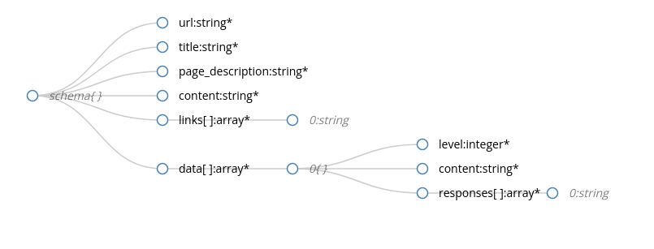

# hse_crawler

## Description

Данный проект реализует веб-краулер для парсинга страниц заданного веб-сайта. Помимо этого, реализованы дополнительные модули для построения веб-графа, а также применения алгоритма PageRank к полученным веб-страницам.

## Usage

Для работы веб-краулера необходимы библиотеки beautiful soup 4 и requests. Их можно установить через

```bash
pip install -r /server/requirements.txt
```
Или по отдельности:
```bash
pip install requests
pip install beautifulsoup4
```
Также необходимо установить парсер. По умолчанию используется lxml. Для его установки используйте

```bash
pip install lxml
```

Для запуска краулера запустите скрипт 

```bash
python3 crawler.py
```
## Config

Работа краулера регулируется при помощи конфигурационного файла. 

Пример конфига можно найти в [файлах проекта](https://github.com/gorbunovakris4/hse_crawler/blob/main/src/configs/crawler_config.json).

В поле parser можно указать один из трех парсеров html-документа: lxml, html5lib, html.parser. Первые два необходимо предварительно установить на устройство.

Параметры, отвечающие за то, какой сайт мы хотим распарсить: 

* domen - нужно указывать домен 0-го и 1-го уровня, 

* allow_subdomains - пропускать ли ссылки поддоменов.

Остальные поля регулируют то, какой контент сайта мы хотим сохранять. Есть 2 основных параметра:

* save_header_article_pairs - сохранять ли пары заголовок - текст для заголовков из header_tags
* save_website_content - сохранять ли текст для элементов с классом из main_classes или для всех элементов, кроме указанных в black_list_classes, black_list_tags

Файлы страниц сохраняют в формате json, [схема](page_doc_schema.json) доступна в файлах проекта, а также приведена на рисунке:

.

## Additional

Помимо скрипта краулера, доступны также вспомогательные скрипты: make_graph и ranking.

Первый строит веб-граф в двух форматах: список ребер и gexf. Второй - считает PageRank. Результаты работы этих скриптов можно использовать для анализа работы вашего сайта.

Запуск:
```bash
python3 make_graph.py
python3 ranking.py
```

Важно! Перед запуском ranking необходимо запустить make_graph, так как данный скрипт предполагает, что граф уже сгенерирован.

